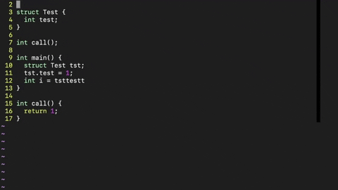

<div>
<span>

[![Contributors][contributors-shield]](https://github.com/zbostock56/Clangpletion/graphs/contributors)

[![Issues][issues-shield]](https://github.com/zbostock56/Clangpletion/issues)

[![MIT License][license-shield]](https://github.com/zbostock56/Clangpletion/blob/main/LICENSE)

[![LinkedIn][linkedin-shield]](https://www.linkedin.com/in/zack-bostock-932a5921b/)
</span>
</div>


<!-- PROJECT LOGO -->
<br />
<div align="center">
  <a href="https://github.com/zbostock56/Clangpletion/tree/main/images/Clangpletion Logo.png">
    
  </a>
<h1 align="center"></h1>

  <h2 align="center">
    Using the Clang complier and Vimscript, Clangpletion gives Vim autocomplete suggestions for C programs.
    <br />
    <a href="https://github.com/zbostock56/Clangpletion"><strong>Explore the docs »</strong></a>
    <br />
    <a href="https://github.com/zbostock56/Clangpletion">View Demo</a>
  </p>
</div>


<!-- ABOUT THE PROJECT -->


## Built With

- [Clang](https://clang.llvm.org/)
- [Vim](https://www.vim.org/)
- [VimScript](https://vimhelp.org/)

<p align="right">(<a href="#top">back to top</a>)</p>

## Usage



Clangpletion works just the same as any other completion engine. Type and the completion engine will give you suggestions!

### Adding recognition of additional non-relative headers
By default, Clangpletion will not recognize headers specified via `#include <...>` that are not located in the default include directories searched by clang (i.e. Clangpletion does not automatically search in include directories that are specified by the `-I` tag during the program's compilation). To add recognition of these header files, call the following function via vim's `call` command:
```
Add_Include_Path("Absolute/Path/To/Include/Dir")
```
For example...
```
:call Add_Include_Path("/home/jack/my_project/include")
```


<p align="right">(<a href="#top">back to top</a>)</p>

## Roadmap

- [ ] Improved performance for large header sets
- [ ] Implementation of config files for specifying additional include paths
- [ ] Greater support for Mac OS

<p align="right">(<a href="#top">back to top</a>)</p>

## License

Distributed under the MIT License. See `LICENSE.txt` for more information.

<p align="right">(<a href="#top">back to top</a>)</p>

## Contact

Zack Bostock - [LinkedIn](https://www.linkedin.com/in/zack-bostock-932a5921b/)

Jack Saysana - [LinkedIn](https://www.linkedin.com/in/jackson-saysana-a5993822a/)

Project Link: [https://github.com/zbostock56/Clangpletion](https://github.com/zbostock56/Clangpletion)

<p align="right">(<a href="#top">back to top</a>)</p>


[contributors-shield]: https://img.shields.io/github/contributors/zbostock56/Clangpletion.svg?style=for-the-badge
[contributors-url]: https://github.com/zbostock56/Clangpletion/graphs/contributors
[forks-shield]: https://img.shields.io/github/forks/zbostock56/Clangpletion.svg?style=for-the-badge
[forks-url]: https://github.com/zbostock56/Clangpletion/network/members
[stars-shield]: https://img.shields.io/github/stars/zbostock56/Clangpletion.svg?style=for-the-badge
[stars-url]: https://github.com/zbostock56/Clangpletion/stargazers
[issues-shield]: https://img.shields.io/github/issues/zbostock56/Clangpletion.svg?style=for-the-badge
[issues-url]: https://github.com/zbostock56/Clangpletion/issues
[license-shield]: https://img.shields.io/github/license/zbostock56/Clangpletion.svg?style=for-the-badge
[license-url]: https://github.com/zbostock56/Clangpletion/blob/master/LICENSE.txt
[linkedin-shield]: https://img.shields.io/badge/-LinkedIn-black.svg?style=for-the-badge&logo=linkedin&colorB=555
[linkedin-url]: https://www.linkedin.com/in/zack-bostock-932a5921b/
[product-screenshot]: images/screenshot.png
